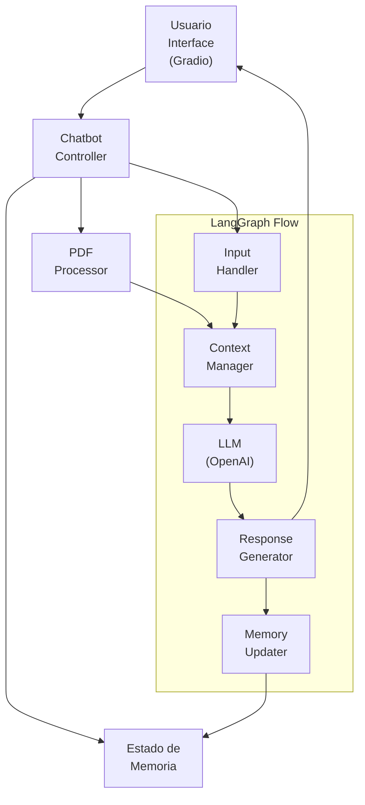

# Chatbot con LangGraph y OpenAI

Este proyecto implementa un chatbot inteligente utilizando LangGraph y OpenAI, con capacidades de memoria y procesamiento de PDFs.

## Arquitectura del Sistema



## Componentes Principales

### 1. Interfaz de Usuario (Gradio)
- Proporciona una interfaz gráfica intuitiva para la interacción con el chatbot
- Permite la carga de documentos PDF
- Muestra el historial de conversación y las respuestas del chatbot

### 2. Chatbot Controller
- Actúa como el cerebro central del sistema
- Coordina la comunicación entre todos los componentes
- Gestiona el flujo de datos y las operaciones del chatbot

### 3. Estado de Memoria
- Mantiene un registro del historial de conversación
- Almacena información contextual relevante
- Permite que el chatbot mantenga coherencia en la conversación

### 4. PDF Processor
- Maneja la carga y procesamiento de documentos PDF
- Extrae texto y contenido relevante
- Prepara la información para su uso en el contexto de la conversación

### 5. LangGraph Flow
El flujo de LangGraph consta de varios subcomponentes:

- **Input Handler**: 
  - Procesa y valida la entrada del usuario
  - Prepara el texto para su procesamiento

- **Context Manager**:
  - Gestiona el contexto de la conversación
  - Integra información del PDF y la memoria

- **LLM (OpenAI)**:
  - Modelo de lenguaje que genera respuestas
  - Procesa el contexto y genera respuestas coherentes

- **Response Generator**:
  - Formatea y estructura las respuestas del LLM
  - Asegura que las respuestas sean apropiadas

- **Memory Updater**:
  - Actualiza el estado de la memoria con nueva información
  - Mantiene la coherencia del historial de conversación

## Requisitos del Sistema

- Python 3.8+
- OpenAI API Key
- Dependencias listadas en `requirements.txt`

## Configuración

1. Instalar dependencias:
```bash
pip install -r requirements.txt
```

2. Configurar la API key de OpenAI:
```bash
export OPENAI_API_KEY='tu-api-key'
```

## Uso

1. Ejecutar la aplicación:
```bash
python chatbot_app.py
```

2. Abrir la interfaz web de Gradio en el navegador
3. Comenzar la conversación con el chatbot
4. Opcionalmente, cargar PDFs para contexto adicional

## Características

- Memoria de conversación persistente
- Procesamiento de documentos PDF
- Interfaz de usuario amigable con Gradio
- Integración con OpenAI
- Flujo de conversación gestionado por LangGraph 