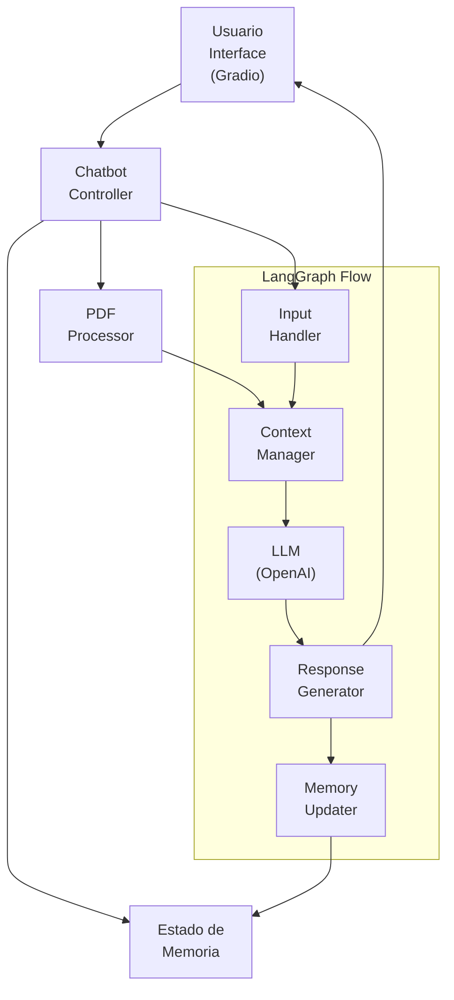

# Chatbot con LangGraph, PDF y Gradio

Este proyecto implementa un chatbot en Python utilizando LangGraph para gestionar el flujo de la conversación, con capacidad para leer archivos PDF y una interfaz de usuario creada con Gradio. Utiliza los modelos de OpenAI para la generación de respuestas.

## Características Principales

- **Procesamiento de Lenguaje Natural**: Utiliza un modelo de lenguaje de OpenAI (por defecto, `gpt-3.5-turbo`) para generar respuestas y mantener conversaciones.
- **Lectura de Documentos PDF**: Permite al usuario cargar archivos PDF, cuyo contenido textual puede ser utilizado por el chatbot para responder preguntas.
- **Memoria Conversacional**: El chatbot recuerda interacciones previas dentro de la sesión actual para mantener el contexto.
- **Flujo de Conversación con LangGraph**: Define un grafo para manejar los estados y transiciones de la conversación.
- **Interfaz de Usuario con Gradio**: Proporciona una interfaz web simple e interactiva.
- **Modularidad**: El código está estructurado para separar la lógica de la interfaz, el procesamiento de PDF y la interacción con el modelo de lenguaje.

## Arquitectura del Sistema



## Componentes Principales

### 1. Interfaz de Usuario (Gradio)
- Proporciona una interfaz gráfica intuitiva para la interacción con el chatbot
- Permite la carga de documentos PDF
- Muestra el historial de conversación y las respuestas del chatbot

### 2. Chatbot Controller
- Actúa como el cerebro central del sistema
- Coordina la comunicación entre todos los componentes
- Gestiona el flujo de datos y las operaciones del chatbot

### 3. Estado de Memoria
- Mantiene un registro del historial de conversación
- Almacena información contextual relevante
- Permite que el chatbot mantenga coherencia en la conversación

### 4. PDF Processor
- Maneja la carga y procesamiento de documentos PDF
- Extrae texto y contenido relevante
- Prepara la información para su uso en el contexto de la conversación

### 5. LangGraph Flow
El flujo de LangGraph consta de varios subcomponentes:

- **Input Handler**: 
  - Procesa y valida la entrada del usuario
  - Prepara el texto para su procesamiento

- **Context Manager**:
  - Gestiona el contexto de la conversación
  - Integra información del PDF y la memoria

- **LLM (OpenAI)**:
  - Modelo de lenguaje que genera respuestas
  - Procesa el contexto y genera respuestas coherentes

- **Response Generator**:
  - Formatea y estructura las respuestas del LLM
  - Asegura que las respuestas sean apropiadas

- **Memory Updater**:
  - Actualiza el estado de la memoria con nueva información
  - Mantiene la coherencia del historial de conversación

## Estructura del Proyecto

El proyecto se encuentra contenido dentro del directorio `01-chatbot` y consta de los siguientes archivos principales:

- `chatbot_app.py`: Contiene toda la lógica de la aplicación.
- `requirements.txt`: Lista todas las dependencias de Python necesarias.
- `README.md`: Este archivo.
- `.env` (Opcional pero Necesario para OpenAI): Debes crear este archivo para almacenar tu clave API de OpenAI.

## Configuración y Ejecución

Sigue estos pasos para configurar y ejecutar el chatbot:

1.  **Navegar al Directorio del Proyecto:**
    Si ya tienes los archivos, simplemente navega al directorio `01-chatbot`:
    ```bash
    cd 01-chatbot
    ```

2.  **Crear un Archivo `.env` para la Clave API de OpenAI:**
    Dentro del directorio `01-chatbot`, crea un archivo llamado `.env` con el siguiente contenido, reemplazando `TU_OPENAI_API_KEY` con tu clave API real de OpenAI:
    ```env
    OPENAI_API_KEY='TU_OPENAI_API_KEY'
    ```

3.  **Crear un Entorno Virtual (Recomendado):**
    Desde dentro del directorio `01-chatbot`:
    ```bash
    python -m venv .venv
    ```
    Activa el entorno:
    - En Windows:
      ```bash
      .\.venv\Scripts\activate
      ```
    - En macOS/Linux:
      ```bash
      source .venv/bin/activate
      ```

4.  **Instalar Dependencias:**
    Asegúrate de que `pip` esté actualizado (`python -m pip install --upgrade pip`) y luego instala las bibliotecas desde `requirements.txt`:
    ```bash
    pip install -r requirements.txt
    ```

5.  **Ejecutar la Aplicación del Chatbot:**
    Desde el directorio `01-chatbot` (con el entorno virtual activado y el archivo `.env` configurado):
    ```bash
    python chatbot_app.py
    ```
    Esto iniciará la interfaz de Gradio. Deberías ver un mensaje en la consola con una URL local (generalmente `http://127.0.0.1:7860`). Si hay problemas con la clave API de OpenAI, verás un mensaje de error en la consola.

6.  **Abrir la Interfaz en tu Navegador:**
    Abre la URL local que se muestra en la consola en tu navegador web.

7.  **Interactuar con el Chatbot:**
    - Escribe mensajes en el cuadro de texto.
    - Sube un archivo PDF usando el componente de carga de archivos.

## Personalización

- **Modelo de OpenAI**: Puedes cambiar el modelo de OpenAI (ej. `gpt-4`, `gpt-4-turbo-preview`) modificando el parámetro `model` en la inicialización de `ChatOpenAI` en `chatbot_app.py`.
- **Prompt del Sistema**: Ajusta el comportamiento del chatbot modificando el `SystemMessage` en la función `agent_node` dentro de `chatbot_app.py`.
- **Interfaz de Gradio**: Modifica los componentes y la apariencia en la sección de montaje de la interfaz Gradio en `chatbot_app.py`. 